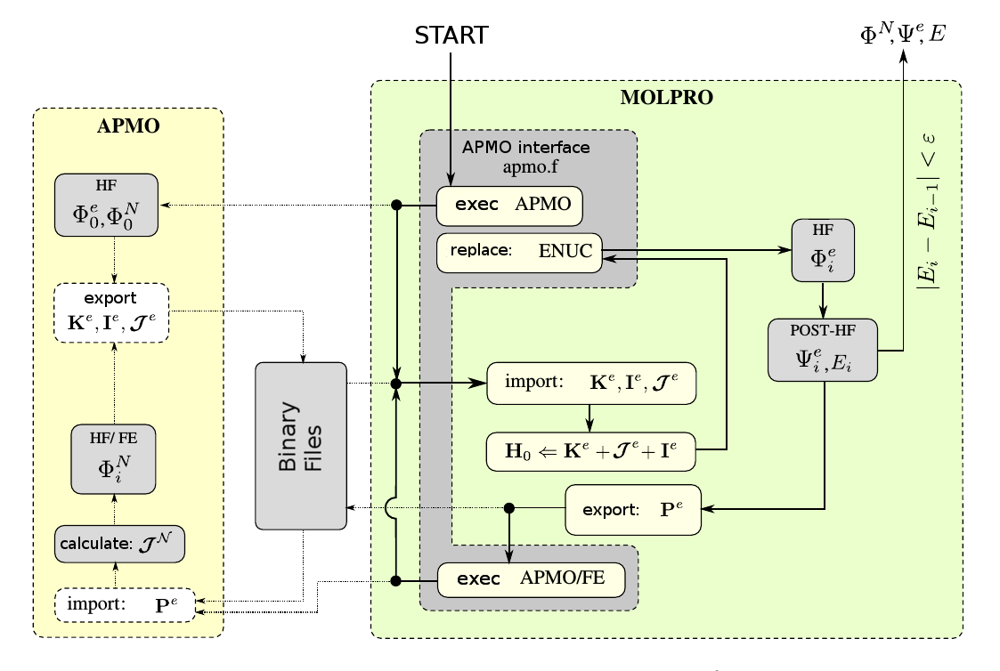
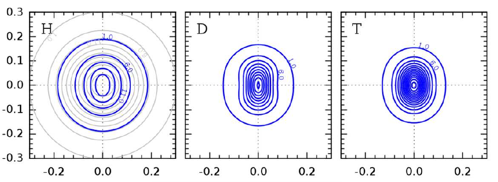
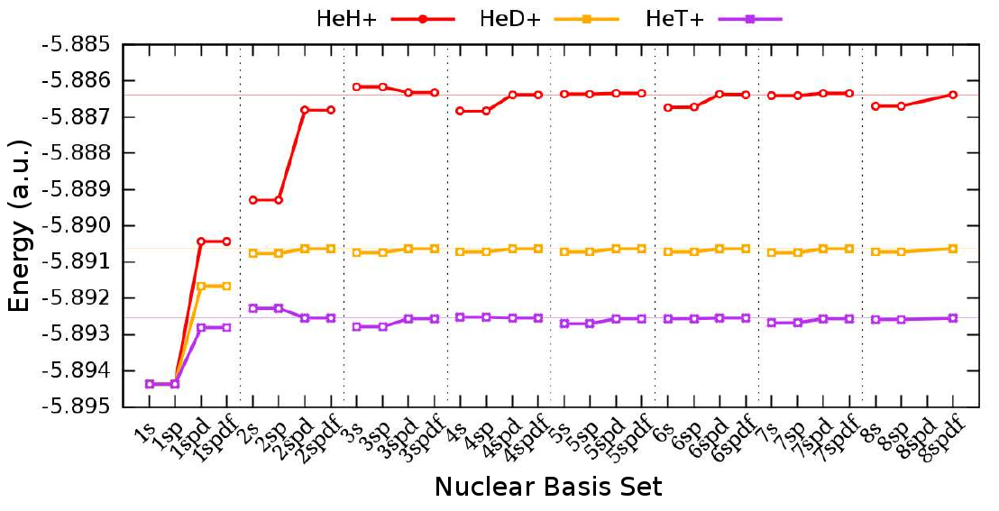

# APMOLPRO

APMOLPRO is an interface between the [APMO](https://sites.google.com/site/lowdinproject/home)
(Any Particle Molecular Orbital) code and the electronic structure package MOLPRO [https://www.molpro.net/].
The any particle molecular orbital APMO code
[\[González et al., *Int. J. Quantum Chem.* **108**, 1742 (2008)\]](https://onlinelibrary.wiley.com/doi/abs/10.1002/qua.21584)
implements the model where electrons and light nuclei are treated simultaneously at Hartree-Fock or
second-order Möller-Plesset levels of theory. The APMO -MOLPRO interface allows to include high-
level electronic correlation as implemented in the MOLPRO package and to describe nuclear quantum
effects at Hartree-Fock level of theory with the APMO code.

The examples given in the paper [\[Aguirre et al. *J. Chem. Phys.* **138**, 184113 (2013)\]](http://dx.doi.org/10.1063/1.4803546)
illustrate the use of this implementation on different model systems: <sup>4</sup>
He<sub>2</sub> dimer as a protype of a
weakly bound van der Waals system; isotopomers of \[He–H–He\]<sup>+</sup> molecule as an example of a
hydrogen bonded system; and molecular hydrogen to compare with very accurate non-Born-Oppenheimer calculations.

Flow diagram of the APMO-MOLPRO interface. 


Specifying the electron and nuclear basis set:
----------------------------------------------
In this example, a basis aug-cc-pVQZ is chosen for the electrons of the hydrogen atoms and a 5sp even-tempered for the hydrogen nuclei.

```
basis={
  set ORBITAL
  H=aug-cc-pVQZ
  
  set NUCBASIS
  s,H,even,nprim=2,ratio=2.5,centre=33.7,dratio=0.8
  p,H,even,nprim=2,ratio=2.5,centre=33.7,dratio=0.8
  
  default ORBITAL
}
cartesian
```

Example of Molpro input file:
-----------------------------
This example corresponds to the calculation of the molecule \[HeHHe\]<sup>+</sup> where helium nuclei and the hydrogen nucleus are represented as quantum particles with an even-tempered basis set and a single 1s function respectively. CCSD(T)/aug-cc-pVQZ level of theory is used for the electronic part.
```
include apmolpro.com

APMOLPRO_maxit = 30
APMOLPRO_tol = 1e-6
APMOLPRO_hforb = 2100.2
APMOLPRO_dm = 21400.2

! First call to APMO to build the nuclear wave function
APMOLPRO_begin={
  {apmo
    species H_1,He_4,He_4
    nucbasis nucbasis,dirac,dirac
    save I,ICOUP
    save J,JCOUP
    save K,KIN
  }
}

! Updating the nuclear energy including the kinetic energy from the nuclei
APMOLPRO_enuc={
  {apmo
    update enuc H_1
  }
}

! Lets to relax the nuclei keeping frozen the electrons
APMOLPRO_nrelax={
  {apmo
    load den EDEN
    frozen e-
    species H_1,He_4,He_4
    nucbasis nucbasis,dirac,dirac
  }
}

! Electronic method to use
APMOLPRO_eMethod={
  ccsd(t)
}

! Nuclear-electron interaction method through the
! first-order reduced density matrix (record=21400.2)
APMOLPRO_cMethod={
  {ccsd
    core 0
    expec relax,dm
    expec dm
    dm $APMOLPRO_dm
    natorb $APMOLPRO_dm
  }
}

basis={
  set ORBITAL

  H=aug-cc-pVQZ
  He=aug-cc-pVQZ

  set NUCBASIS
  s,H,even,nprim=5,ratio=2.5,centre=33.7,dratio=0.8
  p,H,even,nprim=5,ratio=2.5,centre=33.7,dratio=0.8
  d,H,even,nprim=5,ratio=2.5,centre=33.7,dratio=0.8

  s, He, 30.0
  c, 1.1, 1.000000

  default ORBITAL
}
cartesian

r = 0.92491089

set charge=1
symmetry nosym
angstrom
geometry={
  H
  He  1  r
  He  1  r   2  180.0
}

{optg procedure=apmolpro
}

{property
  density $APMOLPRO_dm-10.0
  orbital $APMOLPRO_dm-10.0
  dm
  qm
}

{put molden HeTHeorb.molden
  orb $APMOLPRO_dm-10.0
}
```
Contour plots of the nuclear density for the different isotopic substitutions of the central hydrogen atom in the system \[HeHHe\]<sup>+</sup>.



Optimizing a nuclear basis set:
-------------------------------
This example shows how to optimize variationally the exponent 1s of the Helium atoms in the He<sub>2</sub> diatomic molecule by using the simplex method (geometry optimization included).
```
c1s = 200.0

basis={
  set ORBITAL
  He=aug-cc-pVTZ
  
  set NUCBASIS
  s He c1s
    c 1.1 1.00000
    
  default ORBITAL
}
cartesian

r = 2.99773304

symmetry nosym
angstrom
geometry={
  He
  He 1 r
}

optBasis={
  {optg procedure=apmolpro gradient=1e-5
  }
}

{minimize energy c1s
  method energy simplex,varscale=2,thresh=1e-6,proc=optBasis
}
```
Results of the nuclear basis set optimization (even-tempered) at CCSD(T){CCSD}:HF level of theory for the \[HeHHe\]<sup>+</sup> molecule.


# Authors
* Nestor F. Aguirre ( nfaguirrec@gmail.com )
* Edwin F. Posada ( efposadac@unal.edu.co )
* Andres Reyes ( areyesv@unal.edu.co )
* Alexander O. Mitrushchenkov ( Alexander.Mitrushchenkov@univ-paris-est.fr )
* Maria P. de Lara-Castells ( pilar.delara.castells@csic.es )
